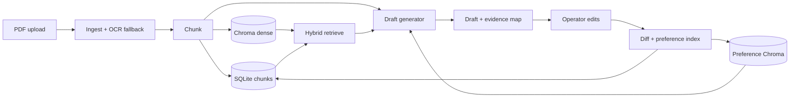

# Architecture overview

## Components

1. **Ingestion (`app/services/ingestion.py`)**  
   Opens PDFs with **PyMuPDF**. If a page has fewer than `LEGAL_WORKFLOW_OCR_CHAR_THRESHOLD` characters, the page is rasterized and processed with **Tesseract** via `pytesseract` when available. Warnings are surfaced when OCR is unavailable or unproductive.

2. **Structured extraction**  
   Implemented as fast, deterministic heuristics over full text (dates, money, party-line hints, headings, coarse document-type tags). Output is `StructuredCaseFields` in the upload response and stored as JSON on the `DocumentRecord`.

3. **Chunking (`app/services/chunking.py`)**  
   Sliding windows over normalized page text with configurable size/overlap. Each chunk gets a stable UUID keyed by page and content hash prefix.

4. **Persistence**  
   - **SQLite** (`ChunkRecord`, `DocumentRecord`, `DraftRunRecord`, `OperatorEditRecord`, `LearnedSnippetRecord`) via async SQLModel.  
   - **ChromaDB** (persistent disk under `data/chroma`): collection `document_chunks` for dense retrieval; collection `operator_preferences` for edit-derived snippets.

5. **Retrieval (`app/services/retrieval.py`)**  
   **Hybrid retrieval**: sentence-transformers embeddings in Chroma plus **BM25** over the same chunk set, fused with **reciprocal rank fusion (RRF)**. This keeps lexical anchors (names, amounts, form numbers) while benefiting from semantic similarity.

6. **Draft generation (`app/services/generation.py`)**  
   - **Default (no API key):** extractive bullets tied to `[E#]` citations—each bullet is sourced from a single retrieved span.  
   - **Optional Gemini (Google AI):** evidence-bound prompt with mandatory inline citations via the `generateContent` API; falls back to extractive mode on errors or empty responses.

7. **Edit learning (`app/services/edit_learning.py` + retrieval preferences)**  
   `difflib.SequenceMatcher` extracts replace/insert/delete fragments with local context. Each meaningful change is stored in SQLite and as a natural-language “preference” document in Chroma so future retrievals for the same `document_id` can surface **operator-specific wording** without claiming new facts.

8. **API + UI (`app/main.py`, `app/static/index.html`)**  
   FastAPI exposes ingest, draft, and feedback endpoints; the root path serves a minimal HTML operator console.

9. **Production middleware (`app/middleware/production.py`)**  
   Request IDs, access logging, baseline security headers (`X-Content-Type-Options`, `X-Frame-Options`, `Referrer-Policy`), and optional per-IP rate limiting.

10. **Operational endpoints**  
    `GET /health` for liveness; `GET /ready` for dependency checks (database query + data directory writable).

11. **Optional API key (`app/deps.py`)**  
    When `LEGAL_WORKFLOW_API_KEY` is set, mutating and document-scoped read routes require `X-API-Key` or `Bearer` token (Swagger “Authorize” compatible for Bearer).

## Data flow

## Inspectability

Every draft response includes parallel structures:

- `evidence[]`: stable `evidence_id` (`E1`…) mapped to `chunk_id`, optional `page_index`, excerpt, and full chunk text.  
- `citations[]`: maps draft lines/spans to `evidence_ids`, supporting audit of which passages supported which statements.
